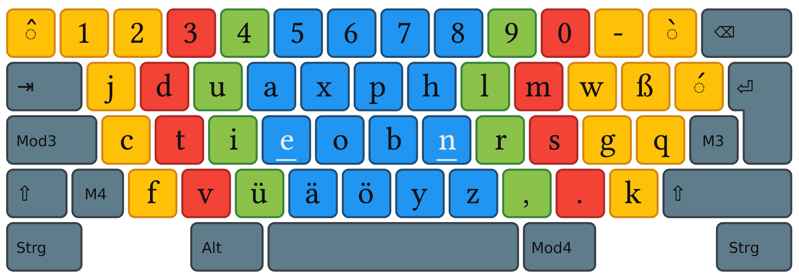
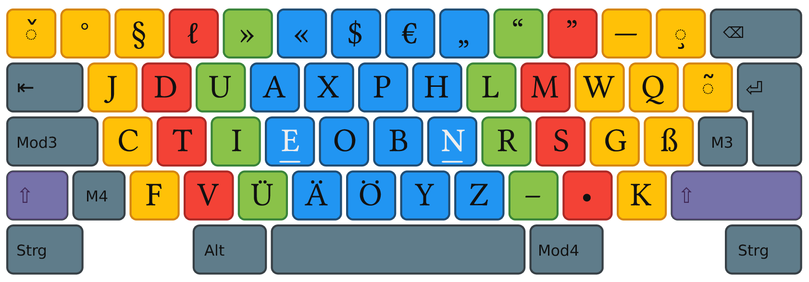
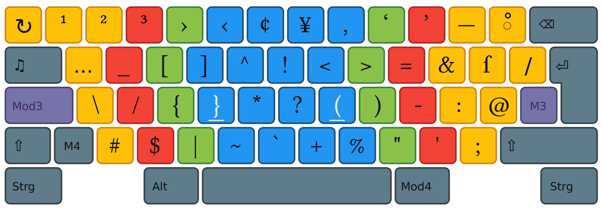
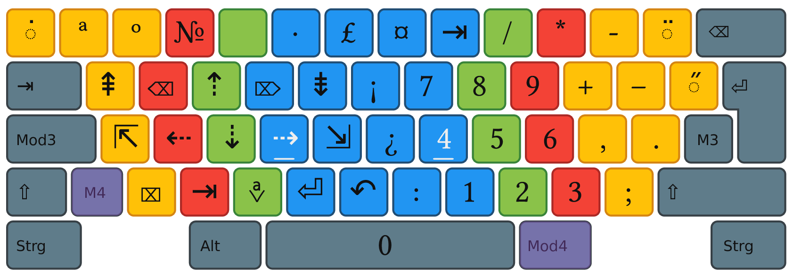
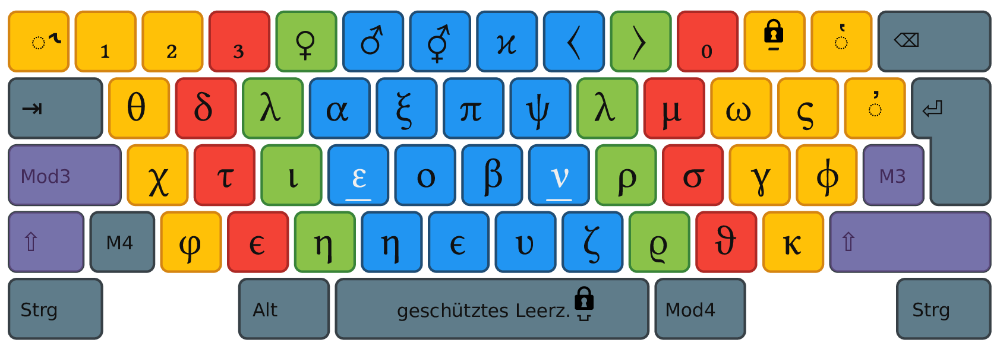
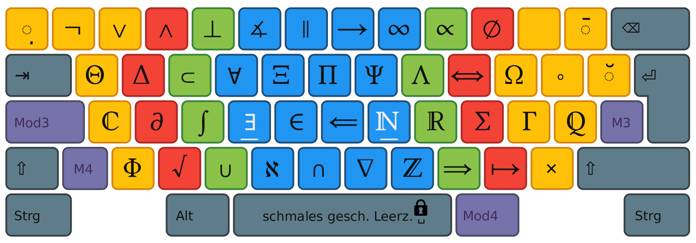

# Bone Keyboard Layout

The Bone-Layout visualized using the [Neo-Layout style](https://github.com/neo-layout/neo-layout/tree/master/grafik/flat).

### E1

### E2

### E3

### E4

### E5

### E6

